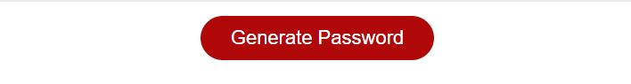

# Web-Password-Generator

## Description

This page is a web password generator which provides a password with a length between 8 and 128 characters, depends on user's choice the password could contain number, upper or lower case letters and special characters.

## Installation

N/A

## Usage

To use this web password generator, you can click on the red button on the middle of the page, shown in image below:

This will open a series of confirmation box on the top of the page, asking how many characters does the user want, is upper or lower case letters included, and if special characters are required to be in the password.

## Credits

N/A

## License

MIT License

## Addition

The javacsript for generate this random password works during test by monitoring the Chrome devTool, however I believe there are something that I couldn't figure it out in the given function writePassword(), since the above variable password works but the value cannot be assigned to variable passwordText. I am not sure how to fix this at this moment.

## Website
The URL is shown below:
https://haozhe-h.github.io/Web-Password-Generator/
